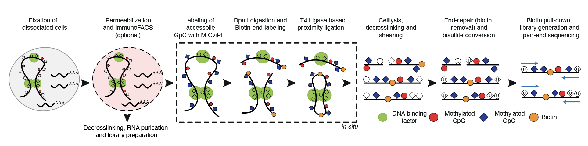

# Joint epigenome profiling reveals cell-type-specific gene regulatory programs in human cortical organoids

<h3><small>Florian Noack1,*, Silvia Vangelisti1,*, Nora Ditzer3, Faye Chong1, Mareike Albert3, Boyan Bonev1,2</small></h3>

Affiliations
1. Helmholtz Pioneer Campus, Helmholtz Zentrum München, 85764 Neuherberg, Germany
2. Physiological Genomics, Biomedical Center, Ludwig-Maximilians-Universität München, Munich, Germany
3. Center for Regenerative Therapies Dresden, Technische Universität Dresden, Dresden, Germany

# List of Figures

* Figure 1 - 3DRAM-seq enables joint profiling of 3D genome organization, chromatin accessiblity and DNA methylation. Associated Extended Data Fig. 1.

* Figure 2 - Comparison of 3DRAM-seq with other multiomic method. Associated Extended Data Fig. 2.

* Figure 3 - 3DRAM-seq enables paired co-accessibility measurements with single-molecule resolution. Associated Extended Data Fig. 3.

* Figure 4 - Combining 3DRAM-seq with immunoFACS enables multimodal profiling of the cell-type specific epigenetic landscpe in human cortical organoids. Associated Extended Data Fig. 4. 

* Figure 5 - Transcription factors associated with epigenome remodeling in cortical organoids. Associated Extended Data Fig. 5.

* Figure 6 - MER130 and UCON31 repetitive elements are associated with changes in accessibility and enriched for neurogenic TF motifs. Associated Extended Data Fig. 6.

* Figure 7 - Cell-type specific MPRA in human cortical organoids. Associated Extended Data Fig. 7.

* Extended Data Fig. 1 - 3DRAM-seq experimental overview and additional quality metrics 

* Extended Data Fig. 2 - Comparison of 3DRAM-seq with other methods 

* Extended Data Fig. 3 - Paired single molecule accessibility across different genomic features 

* Extended Data Fig. 4 - 3DRAM-seq in purified neural progenitors from human cortical organoids

* Extended Data Fig. 5 - Further characterization of epigenome dynamics in human cortical organoids 

* Extended Data Fig. 6 - Epigenome dynamics at TE in human and mouse cortical development 

* Extended Data Fig. 7 - In organoid MPRA identifies cell-type-specific enhancer activity in human neural development 
